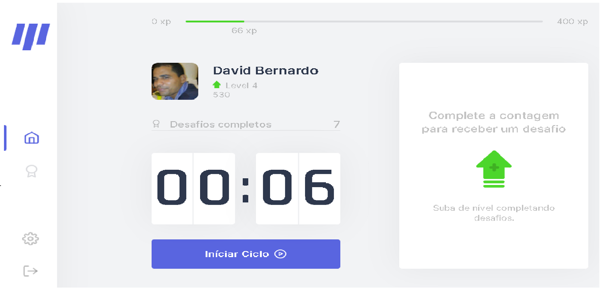

<p align="center">
  <a href="https://nextlevelweek.com/inscricao/4">
    
  </a>
  <p align="center">
   
</p>

<p align = "center"> Aplicativo desenvolvido na quarta edição da Rocketseat Next Level Week 💻🚀 </p>

<p align = "center">
 <a href="#objective"> Objetivo </a> •
 <a href="#technologies"> Tecnologias </a> •
 <a href="#usage"> Uso </a> •
 <a href="#contribution"> Contribuição </a> •
 <a href="#author"> Autor </a> •
 <a href="#license"> Licença </a>
</p>


<h4 align = "center">
🚧 Movei.it | NLW # 4 ⏰📈 Carregando ... 🚧
</h4>
<p align="center">
    <a href="README.md">English</a>
    ·
    <a href="README-pt.md">Portuguese</a>
 </p>

   <p align="center">
   
</p>


<h2 id = "objective"> 🎯 Objetivo </h2>

Controle o seu tempo, seja mais produtivo e cuide da sua saúde. <a href="https://move-it-next-five.vercel.app/"> </a> foi desenvolvido para gerenciamento de tempo, como na técnica de pomodoro, dividindo o trabalho em períodos de 25 minutos. Depois desse tempo, ele libera um desafio, que é um alongamento para o corpo ou exercícios para os olhos. Cada desafio tem seus pontos de xp e, acumulando os pontos você sobe de nível.

O layout do move.it original está disponível <a href="https://www.figma.com/file/ge20pu3ofMOKoliUyKx1Nl/?viewer=1&node-id="> aqui </a>.

<h2 id = "technologies"> 🛠 Tecnologias </h2>

As seguintes ferramentas foram utilizadas na construção do projeto:

- [ReactJS] (https://reactjs.org)
- [NextJS] (https://nextjs.org)
- [NodeJS] (https://nodejs.org/en/)
- [Yarn] (https://yarnpkg.com) ou Npm
- [VSCode] (https://code.visualstudio.com)
- [Git Bash] (https://gitforwindows.org/)

<h2 id = "usage"> 👷 Uso </h2>

## :rocket: Começando
``` bash
  # Clonar o projeto:
$ git clone: https://github.com/sdavi38/Moveit.git
  # Entrar no diretório:
  $ cd Moveit

  # Instalar as dependências:
  $ yarn

```
``` bash
  # Rodar a aplicação:
  $ yarn dev
```


<h2 id = "Contribution"> 🤝 Contribuição </h2>

Este projeto é para fins de estudo também, então me mande um e-mail me contando o que você está fazendo e por que está fazendo, me ensine o que você sabe. Todos os tipos de contribuições são muito bem-vindos e apreciados!

<h2 id = "author"> 💻 Autor </h2>


Por David Bernardo 👋🏽 Encontre-me:

### :closed_book: License

Released in 2020 :closed_book: License

Made with love by [David Bernardo](https://github.com/sdavi38) 🚀.
This project is under the [MIT license](./LICENSE).


Dê um ⭐️ se este projeto te ajudou!